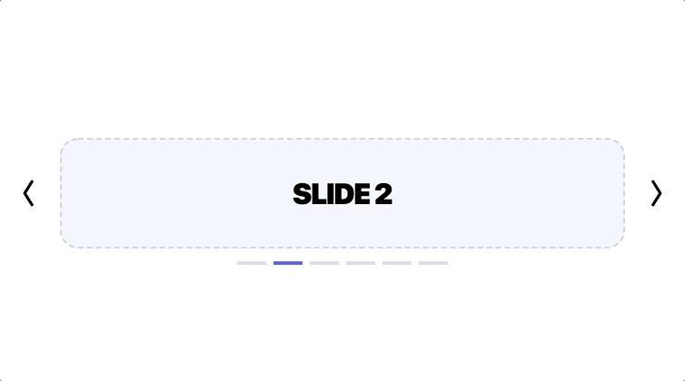

# Usage/Examples

```html
<angular-carousel>
    <ng-template *angularCarouselSlide>
        Slide 1
    </ng-template>
    <ng-template *angularCarouselSlide>
        Slide 2
    </ng-template>
    <ng-template *angularCarouselSlide>
        Slide 3
    </ng-template>
</angular-carousel>
```

## Options

### `[bullets]` (`boolean`) (default: `true`)

Show or hide the bullets.

```html
<angular-carousel [bullets]="false">
    <!-- slides -->
</angular-carousel>
```


### `[infinite]` (`boolean`) (default: `false`)

Enable or disable infinite sliding.

```html
<angular-carousel [infinite]="true">
    <!-- slides -->
</angular-carousel>
```



### `[auto]` (`boolean`) (default: `false`)

Enable or disable auto sliding.

```html
<angular-carousel [auto]="true">
    <!-- slides -->
</angular-carousel>
```


### `[duration]` (`number`) (default: `5000`)

Duration (in ms) of transition between slides (if `[auto]` is enabled)

```html
<angular-carousel [duration]="2500">
    <!-- slides -->
</angular-carousel>
```
